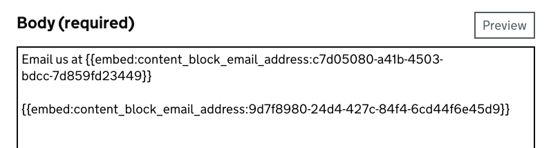
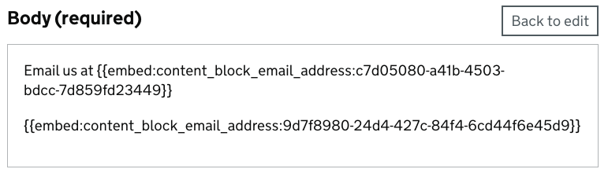

# Decision Record: Move Content Block rendering logic to external gem

## Context

Content blocks within Publishing API are a relatively new concept, that mainly sits with the Content
Modelling Team. Whilst still in development, the basic concept is that a publishing user will be able
to embed a "block" of reusable content within a document, and it will then be rendered within the 
document on publication. When the content of the block changes, all pages that use the block will 
change to show the latest information.

When a piece of content that uses a content block (or content blocks) is sent to the publishing API,
we first scan over each field within the content to find embed codes, which currently look like this:

```markdown
{{embed:$embed_type:$uuid}}
```

Where `$embed_type` is the type of content to be embedded and `$uuid` is the content ID of the content
block.

If there are any embed codes found, these are added as "links" to the content within Publishing API
([See here for more information about links and link expansion](https://github.com/alphagov/publishing-api/blob/main/docs/link-expansion.md)).

When the piece of content is sent to the Content Store (either draft or live), we scan the content
again for embed codes, and replace the embed code with the actual content block content.

At the moment, this is fairly simple, contacts are replaced with the Title (as contacts work is
still a work in progress) and email addresses are replaced with the email. However, as this work
progresses, it is envisioned that embedded content rendering will get significantly more complex.

Additionally, there are places where we need access to the embed logic outside of Publishing API:

### Whitehall Live Preview

At the moment, when a user clicks on "Preview" within Whitehall, it takes the content from the 
body field, and  uses the Govspeak gem (and some additional Whitehall-specific logic) to 
render the Govspeak.

Currently, Whitehall or Govspeak does not understand the embed code, so embed codes are left
untouched:





We therefore need a way to handle the embed codes within live preview

### "In-app" preview within Content Block Manager

When editors are making changes to content blocks within the Content Block Manager, it's important
for users to be able to see the changes they make within the context of the pages that use the
blocks.

We can't use the existing draft stack because:

a) We want to show the content block changes in the context of the live documents; and
b) Publishing content block changes to the draft stack could cause confusion when a user
is previewing the changes to their own content and seeing unpublished changes to a content block

With this in mind, we are proposing that we fetch the HTML of live content and then run a 
find/replace against the HTML of a content block with the HTML of the current draft, then rendering
this HTML within our app.

Both of these solutions require each application having knowledge of how a content block will be
rendered.

Initially we considered having an API endpoint within Publishing API to "preview" a content block.
However, this was discounted because:

a) We run the risk of overloading the Publishing API with extra API endpoints
b) There is not much rendering logic in Publishing API itself, and logic will potentially get more
complex as content blocks evolve
c) If there are a number of content blocks within a page, this may cause a performance issues when
making multiple calls to an API

## Decisions

We are proposing moving the Content Block rendering logic to the [govuk_publishing_components](https://github.com/alphagov/govuk_publishing_components/) gem.

This will give a single source of truth for how content blocks are rendered, which can be easily pulled
into other applications.

## Consequences

Once the work to move the logic into the gem is approved, we will then need to add govuk_publishing_components as
a dependency in Publishing API to ensure the gem is the only source of truth. 

We will then be able to carry out the two pieces of work as detailed above. They are both contained within
the Whitehall application, which already has govuk_publishing_components as a dependency.

One possible downside is we will need to release a new version of a gem and ensure it is used in each application
when a change occurs, but as we don't expect to be making changes regularly, we believe this risk is minimal.
