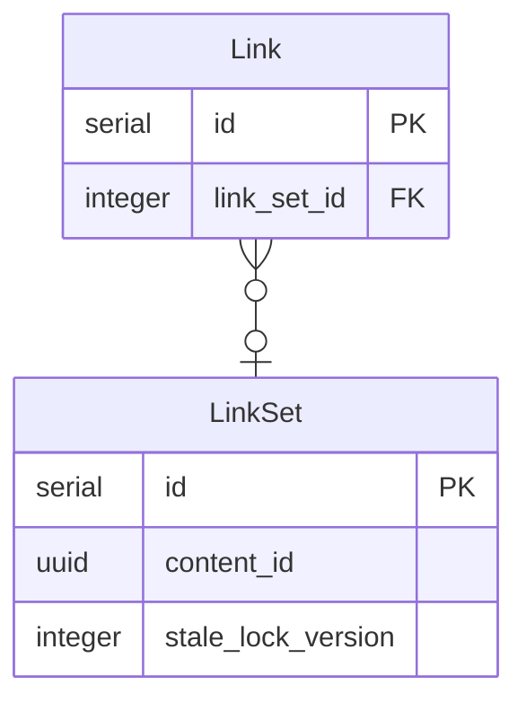
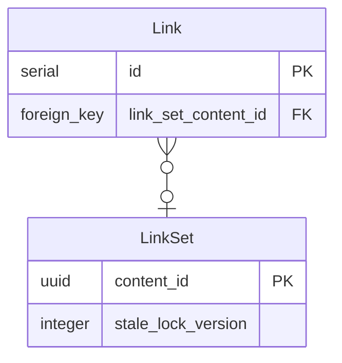

# Decision Record: Change link_sets primary key from serial to content_id

## Context

Publishing API has the concept of "link sets".

A link set comprises all the links belonging to a particular content_id. Links can have various link types and
positions, but if they belong to the same content_id, they're part of the same link set.

Link sets are exposed through the API as a resource - you can get the link set of a content_id
using [GET /v2/links/:content_id](https://github.com/alphagov/publishing-api/blob/main/docs/api.md#get-v2linkscontent_id),
and you can update them
using [PATCH /v2/links/:content_id](https://github.com/alphagov/publishing-api/blob/main/docs/api.md#patch-v2linkscontent_id).

Because there's a potential race condition between getting and updating a link set, they have a lock version column. For
example, two processes fetch a link set which looks like this:

```json
{
  "links": {
    "organisations": [
      "591436ab-c2ae-416f-a3c5-1901d633fbfb"
    ]
  }
}
```

And the first process attempts to add `492b07ba-1a83-4163-9d1f-37fa8a088b77` as an organisations link, and the second
process attempts to add `489743df-25bd-45b3-b799-5bfcab131cce`, the request that comes later should fail because it's not
updating the latest version of the resource.

To enable this, link_sets have a stale_lock_version column, which is incremented on every update.

## Problem

The current database schema has link sets as a separate table, with a foreign key relationship to the links table.



Although this is nicely normalized, the presence of the link_sets table necessitates an additional join when following
the links of a document. Assuming we already know the content_id we're starting from, and the link_type we're following,
we need to do:

```
select links.*
from link_sets
join links on link_sets.id = links.link_set_id
and link_sets.content_id = ?
and link_type = ?
```

While postgres is usually pretty good at using appropriate indexes to join these two tables together, there are
occasions when a query we would like to write can't be planned efficiently. For example, if we knew the edition id and
content id of a particular edition, and we wanted to find both link set and edition links, we might want to do:

```
select links.* from link_sets
join links on link_sets.id = links.link_set_id
where (content_id = '77fb899a-a86c-4bf4-858f-229ea665f02d' or edition_id = 6488459)
and link_type = 'organisations';
```

However, because content_id and edition_id are on different tables, postgres can't join the two indexes together.
Instead, it will come up with a rubbish query plan which takes tens of seconds to
execute. [As described in this article](https://www.cybertec-postgresql.com/en/avoid-or-for-better-performance/), this
can be worked around by doing a UNION ALL instead of an OR, but this increases the complexity of the query
significantly.

The link sets table has two columns with unique constraints - the id column (which is a serial) and the content_id
column (which is a uuid). This means there's a one-to-one equivalence between id and content_id.

The problem is that the links table refers to link_sets with a foreign key to its id. If it used a foreign
key to content_id instead, we would be able to avoid the join in link expansion situations, and postgres would be able
to use its [clever index combination techniques](https://www.postgresql.org/docs/current/indexes-bitmap-scans.html) (
BitmapOr specifically) to come up with efficient plans.

## Solution

Glossing over the steps to make this change, which are below, the proposed solution is that we would replace the
link_set_id column on links with a link_set_content_id column, and corresponding foreign key. So we'd have:



Link sets would still exist as its own model and table, as we need it for the lock version we use for optimistic locking.

Because the links table would now have a column with the content_id in it, we could avoid joining link_sets when doing
link expansion, instead doing something like:

```
select * from links
where (link_set_content_id = '77fb899a-a86c-4bf4-858f-229ea665f02d' or edition_id = 6488459)
and link_type = 'organisations';
```

Even though this looks very similar to the query above, it's much more performant. This is for two reasons:

- We avoid the unnecessary join to link_sets
- Both the link_set_content_id and edition_id columns are on the same table, so if they're both indexed postgres can do
  a BitmapOr on the indexes to efficiently find links where one or the other is true.

It would also simplify the code in publishing-api somewhat, by removing most of the places where we need
to [joins(:link_set)](https://github.com/alphagov/publishing-api/blob/e4b7b185346a1242cb85dda4379ba22318ff0ab5/app/queries/links.rb#L107).

## Steps to implement

We'll need to coordinate changes to the database schema and changes to the code to avoid causing downtime.

### 1 - Add the new column

Firstly, we'll need to add the new column:

```
class AddLinkSetContentIdToLinks < ActiveRecord::Migration[8.0]
  def change
    add_column :links, :link_set_content_id, :uuid
    add_foreign_key :links, :link_sets, column: :link_set_content_id, primary_key: :content_id
  end
end
```

We can add the foreign key constraint immediately, because we never want to allow values in this column which don't
exist in the link sets table.

At this point the old link_set_id column is still there, and the code will still be using that. The new column will
initially be all nulls.

### 2 - Update the code to write to both columns

Whenever new links are added, we'll need to write both the link_set_id column and the link_set_content_id column. This
is the first step towards fully populating the column.

For example,
in [the patch link sets code](https://github.com/alphagov/publishing-api/blob/9447ded9df0678167735f433ecc2acba2c1be6ef/app/commands/v2/patch_link_set.rb#L21)
we would need to write the link_set.content_id to the link_set_content_id on each link we create. There might be a few
other places in the code where we create links, or if we're lucky this might be the only one.

### 3 - Populate the new column

We should be able to do something like this:

```
update links
set link_set_content_id = link_sets.content_id
from link_sets
where links.link_set_id is not null and links.link_set_id = link_sets.id;
```

On my local database, this did `5,349,185 rows affected in 15 m 3 s 918 ms`. I'm not sure how much locking happened during
this window - we might want to populate the links in batches if we're worried about locking other queries.

### 4 - Add indexes

There are three indexes on link_set_id in the current schema:

* index_links_on_link_set_id
* index_links_on_link_set_id_and_link_type
* index_links_on_link_set_id_and_target_content_id

The statistics on index scan usage suggests these are all used:

```shell
kubectl exec deploy/publishing-api -- rake pg_extras:index_scans | awk 'NR<7 || /index_links_on_link_set_id/ {print} END {print}'
```
```
+-------------------------------------------------------------------------------------------------------------------------+
|                                          Number of scans performed on indexes                                           |
+------------+----------------------+---------------------------------------------------------+------------+--------------+
| schemaname | table                | index                                                   | index_size | index_scans  |
+------------+----------------------+---------------------------------------------------------+------------+--------------+
| public     | links                | index_links_on_link_set_id_and_target_content_id        | 909 MB     | 10190392530  |
| public     | links                | index_links_on_link_set_id_and_link_type                | 683 MB     | 1233485761   |
| public     | links                | index_links_on_link_set_id                              | 567 MB     | 6082986136   |
+------------+----------------------+---------------------------------------------------------+------------+--------------+
```

So it makes sense to create the same indexes on link_set_content_id:

```
add_index :links, [:link_set_content_id], algorithm: :concurrently
add_index :links, [:link_set_content_id, :link_type], algorithm: :concurrently
add_index :links, [:link_set_content_id, :target_content_id], algorithm: :concurrently
```

Adding these indexes concurrently will take around twice as long, but will avoid locking the table.

Note that these indexes will be larger than the indexes on link_set_id, because uuids are bigger than serial ids.

### 5 - Check that the column is completely populated

As a sanity check, we can check that all the links that have link_set_id all have the correct values for link_set_content_id:

```
select count(*) from links
join link_sets on link_sets.id = links.link_set_id
where link_sets.content_id != links.link_set_content_id;
```

This should return zero. Note this query may take several minutes, as it needs to scan the whole links table.

### 6 - Update the code to use the new link_set_content_id column

This will be the biggest change to the publishing-api codebase. Everywhere where we join links and link_sets we'll need
to decide whether to remove the join (because we only needed content_id from link_sets, and we can now use
link_set_content_id), or to update the join to use the new column.

We should also update the LinkSet model so that it treats content_id as its primary key instead of id, and make sure
that we update any situations where we're doing something like:

```
LinkSet.find(id)
```

To

```
LinkSet.find(content_id)
```

At this point, the code is using the new column, and we should get all the performance benefits it brings. The rest of
the process is cleanup really, but it's worth doing to avoid leaving things in a confusing state.

### 7 - Drop indexes and constraints on link_set_id

The indexes shouldn't be used anymore, so dropping them should be safe. We can also drop the foreign key constraint from
link_sets to links, as we don't care about enforcing it anymore.

### 8 - Stop writing to the link_set_id column

At this point, we can update the code not to populate the link_set_id column on the links table, so only the
link_set_content_id column is used. We need to be sure that we've done step 6 properly at this point, and that the code
isn't using link_set_id anywhere, or stopping writing to it could cause confusing bugs.

### 9 - Remove the link_set_id column from links

🔪

### 10 - Remove the id column from link_sets

Assuming we've already removed all the constraints and indexes that use id, it should now be safe enough to do this:

```sql
-- 1. Drop the original primary key
ALTER TABLE link_sets DROP CONSTRAINT link_sets_pkey

-- 2. Rename existing index
ALTER INDEX index_link_sets_on_content_id RENAME TO link_sets_pkey

-- 3. Create new primary key using existing index
ALTER TABLE link_sets ADD PRIMARY KEY USING INDEX link_sets_pkey

-- 4. Drop the old column
ALTER TABLE link_sets DROP COLUMN id;
```

We could do these in a rails migration using the execute method. Might be better to just
do them in a SQL console though.

Probably best to update the schema.rb file at this point too.  

### 11 - Celebrate 🎉

Link expansion is now easier to do! We need fewer joins, and we can get more efficient query plans! Hooray!

## Consequences

### Positive

- Link expansion SQL queries will be simpler (requiring fewer joins), and faster (making better use of indexes)
- The publishing-api codebase will be simpler, as we'll be able to remove a lot of the join logic

### Negative

- Index size will increase, as the new indexes will be larger than the old ones
- We'll have to make the changes in a number of steps, some of which may be somewhat risky. This should be manageable
  with careful planning and testing.
